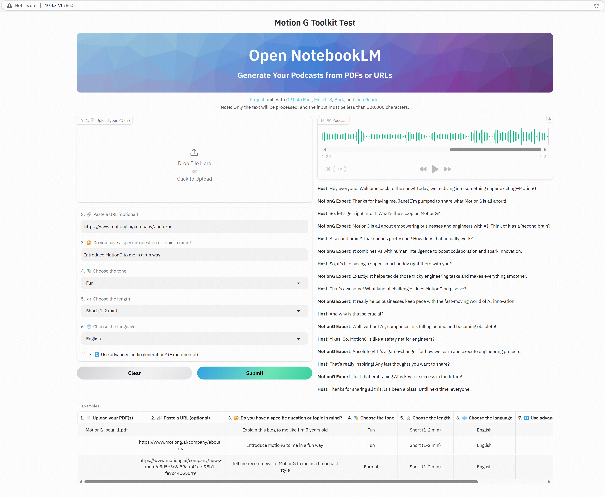

# Open NotebookLM

## Overview

This project is inspired by the NotebookLM tool, and implements it with open-source LLMs and text-to-speech models. This tool processes the content of a PDF, generates a natural dialogue suitable for an audio podcast, and outputs it as an MP3 file.

Docker image `open-notebooklm-test:1.1`
hosted at [`http://10.4.32.1:7860/`](http://10.4.32.1:7860/) for MotionG internal test use.

Built with:
- [GPT-4o Mini 🤖](https://huggingface.co/openai/gpt-4o-mini) via [OpenAI 🌐](https://openai.com/)
- [MeloTTS 🐚](https://huggingface.co/myshell-ai/MeloTTS-English)
- [Bark 🐶](https://huggingface.co/suno/bark)
- [Jina Reader 🔍](https://jina.ai/reader/)

## Screenshot


## Features

- **Convert PDF to Podcast:** Upload a PDF and convert its content into a podcast dialogue.
- **Engaging Dialogue:** The generated dialogue is designed to be informative and entertaining.
- **User-friendly Interface:** Simple interface using Gradio for easy interaction.

## Installation

To set up the project, follow these steps:

1. **Clone the repository:**
   ```bash
   git clone https://github.com/motiong-io/open-notebooklm-test.git
   cd open-notebooklm
   ```

2. **Create a virtual environment and activate it:**
   ```bash
   python -m venv .venv
   source .venv/bin/activate
   ```

3. **Install the required packages:**
   ```bash
   pip install -r requirements.txt
   ```

## Usage

1. **Set up API Key(s):**
   Check constants.py

2. **Run the application:**
   ```bash
   python app.py
   ```
   This will launch a Gradio interface in your web browser.

3. **Upload a PDF:**
   Upload the PDF document you want to convert into a podcast.

4. **Generate Audio:**
   Click the button to start the conversion process. The output will be an MP3 file containing the podcast dialogue.

## Acknowledgements

This project is forked from [`knowsuchagency/pdf-to-podcast`](https://github.com/knowsuchagency/pdf-to-podcast)

## License

This project is licensed under the Apache 2.0 License. See the [LICENSE](LICENSE) file for more information.
